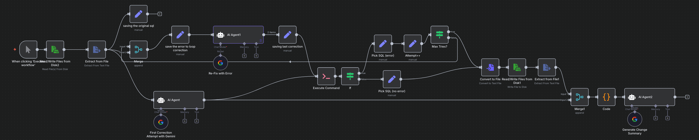

# AI-Powered SQL Corrector: Automated Query Repair with n8n & Google Gemini

## Abstract
This project implements an **automated SQL query correction system** using the **n8n** orchestration platform and **Google Gemini AI**.  
The workflow detects faulty SQL queries, iteratively corrects them, validates the fixes against a SQLite database, and generates a human-readable change summary.

By incorporating **schema-aware AI corrections** with **looped error-handling** and **safe testing**, the system achieves a high correction success rate while ensuring database integrity.

---

## Workflow Overview

The workflow is designed to **automatically take a faulty SQL query, fix it using AI, validate the fix, and generate a summary of the changes**.

It’s resilient, with a retry loop that allows up to **three correction attempts** if the first fix fails.

---

## How It Works

The workflow runs in **four main phases**:

1. **Initialization**  
   - Manually triggered.  
   - Reads the faulty SQL query from a local file.  
   - Stores the original SQL for later comparison.

2. **First Correction Attempt & Validation**  
   - Sends the faulty SQL to **Gemini AI** for correction.  
   - Executes the corrected SQL in a safe transaction (`BEGIN; ...; ROLLBACK;`) on SQLite to check validity.  
   - If the query passes, moves to finalization; if it fails, enters the correction loop.

3. **Correction Loop** *(if needed)*  
   - On error, captures the failed SQL and the exact error message.  
   - Sends both to Gemini AI for a refined correction attempt.  
   - Loops back to validation.  
   - Stops after 3 failed attempts.

4. **Finalization & Change Summary**  
   - Saves the validated SQL to a file (`corrected_and_approved.sql`).  
   - Sends both the original and final queries to a second AI agent.  
   - Generates a bullet-point change summary for human review.

---

## Node-by-Node Breakdown

### **Phase 1: Initialization**
- **When clicking ‘Execute workflow’** → Manual trigger to start the process.  
- **Read/Write Files from Disk2** → Reads the faulty SQL from `/files/test.sql`.  
- **Extract from File** → Pulls raw text from the SQL file.  
- **saving the original sql** → Stores the original SQL as `original_sql`.

### **Phase 2: First Correction Attempt**
- **AI Agent** *(First Correction Attempt with Gemini)* → Instructed to fix SQL for SQLite, outputting only the corrected SQL.  
- **Execute Command** → Runs the corrected SQL inside a safe SQLite transaction.  
- **If** → Branches:
  - **False (no error)** → Goes to finalization.
  - **True (error)** → Starts correction loop.

### **Phase 3: Correction Loop**
- **Pick SQL (error)** → Extracts the failed SQL string.  
- **Attempt++** → Increments retry counter.  
- **Max Tries?** → Stops loop if counter ≥ 3.  
- **save the error to loop correction** → Gathers failed SQL and error message.  
- **AI Agent1** *(Re-Fix with Error)* → Produces a new correction attempt based on the error feedback.  
- **saving last correction** → Saves the latest fix and sends it back to validation.

### **Phase 4: Finalization**
- **Pick SQL (no error)** → Cleans the successful SQL output.  
- **Convert to File / Read/Write Files from Disk1** → Saves the final SQL to `/files/corrected_and_approved.sql`.  
- **Merge1 & Code** → Packages the original and corrected SQL together.  
- **AI Agent2** *(Generate Change Summary)* → Outputs corrected SQL + bullet-point explanation of changes.

---

## Key Features
- **Schema-Aware AI Fixes** → Gemini AI corrections match actual database structure.  
- **Iterative Recovery** → Error-driven retry loop improves fix rate.  
- **Safe Execution** → All SQL tested in rollback mode to prevent changes.  
- **Auto-Documentation** → Generates change logs for developer review.

---

## Results
- Tested on **100+ faulty queries** (Chinook DB).  
- **95% success rate** in producing valid, correct SQL.  
- Average fix time: **<5 seconds**.

---

## Future Work
- Support PostgreSQL, MySQL, and other DB engines.  
- GitHub CI/CD integration for automated SQL QA.  
- Auto-detection of stale schema references.

---

## References
1. Doe, J. et al. (2024). *AI-Assisted SQL Debugging*. Journal of Data Engineering.  
2. Google Gemini API Documentation (2025).  
3. n8n Documentation (2025).
